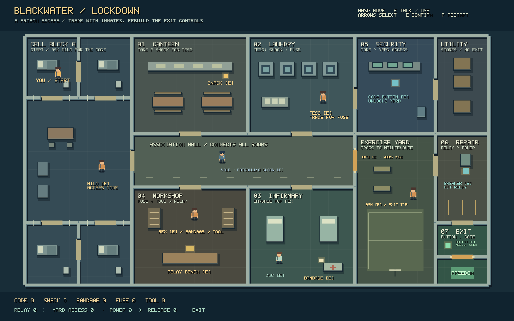

# Night Shift / Blackwater

Two original, data-only prison escape levels for YK Engine. Open `project.ykproj` in the editor or run:

```sh
./build/dev/yk_player YK-SimulationDemo
```

## Blackwater — Lockdown

The new default level is a connected 52 × 28 prison with four cells, an association hall, canteen,
laundry, workshop, infirmary, security office, utility stores, exercise yard, maintenance room and
an exit lane. Six NPCs include an actual patrolling guard, two inmate traders, a guide, a medic and
an inmate with an exit hint. Furniture has collision; both locked gates cover their whole openings.



The room headers and object labels are part of the running game. `[E]` means stand near that object
or person and press **E**. The bottom progress strip shows acquired items and completed steps as
`1`; traded snacks and bandages return to `0`. Blue objects are controls, gold items and labels are
supplies or inmate interactions, and the green control and zone mark the final release and escape.

1. Leave your cell and talk to **Milo** in the common wing to record the security code.
2. Take the **snack** from the canteen counter. In the laundry, talk to **Tess** and choose the trade
   to exchange it for a **fuse**.
3. Take the **bandage** beside the infirmary cabinet. Talk to **Rex** in the workshop and trade it
   for his **screwdriver** (shown as `TOOL` in the log).
4. Use the workshop's **relay bench**. It requires both fuse and tool and gives a rebuilt relay.
5. Enter **security through the laundry's east door**. Use the blue code button with Milo's code.
   Return through the laundry to the hall and open the **yard gate** with E.
6. Cross the yard into maintenance. Use the blue **breaker** with the rebuilt relay to restore power.
7. Walk south through the maintenance doorway. Press the green **release button**, open the final
   gold **gate** with E, and enter **FREEDOM**. The result is `ESCAPED FROM BLACKWATER!`.

The two trades can be completed in either order. Asking before having an item explains what to
bring; the relay bench explains missing parts. The guard is a moving, conversational NPC, not a
stealth detection system. Doc and Ash supply optional hints.

**Controls:** WASD or arrows to move, E or Space to interact, arrows to select a dialogue choice,
E to confirm/close, R to restart. Restart resets pickups, trades, repaired controls and gates.

`tools/build_blackwater.py` regenerates the scene, dialogue graphs and small authored pixel sprites
(requires Python 3 and Pillow). The headless `blackwater_demo` test checks trades, missing parts,
locked collision, walking through room doors, the complete repair-to-exit route and restart.
Capture the actual player with:

```sh
./build/dev/yk_player YK-SimulationDemo --frames 100 --fixed --no-audio --capture /tmp/blackwater.bmp
sips -s format png /tmp/blackwater.bmp --out YK-SimulationDemo/blackwater-preview.png
```

## Original Night Shift

The original smaller level is preserved:

```sh
./build/dev/yk_player YK-SimulationDemo --scene scenes/night_shift.ykscene
```

1. In the cell, take the yellow keycard beside the locker and the orange wire by the desk.
2. Use the keycard to open the first gate.
3. Repair the blue control panel with the wire.
4. Open the outer gate and step into the green exit. `ESCAPED!` is the win state.

`tools/build_level.py` regenerates `scenes/night_shift.ykscene`. The `simulation_demo` test continues
to check this original route. Both levels use standard YK components with no prison-specific engine code.
